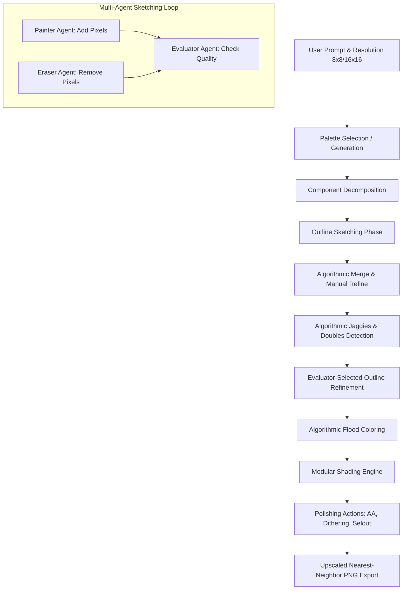

# Reimagining BadPixelArt: Multi-Agent Co-Creation Workflow

This document outlines the architectural plan for rewriting the `BadPixelArt` application. It translates the 8 classic pixel art workflow steps into a collaborative human-AI environment utilizing a multi-agent orchestration pattern (Painter, Eraser, Evaluator, Polisher) and algorithmic pixel helpers.

---

---

## 🛠️ Step-by-Step Architecture

### Step 1: Planning & Resolution Selection
* **UI Interface:** Simple toggle for **8x8** or **16x16** canvas grids. Larger sizes are deferred to prevent LLM context bloat and tiling-of-attention issues.
* **Metadata Structure:** The workspace resolution is initialized as a configuration parameter passed down to all agents and drawing algorithms.

### Step 2: Palette Selection & Restriction
* **Three Sources of Palette Generation:**
  1. **Retro Presets:** Classic systems (e.g., Game Boy 4-color, NES, PICO-8).
  2. **AI-Generated (8-color):** Multi-modal LLM processes a reference image and outputs 8 tailored hex colors.
  3. **Algorithmic (8-color):** K-Means clustering or Median-Cut quantization runs locally on a reference image to extract the dominant 8 colors.
* **Palette Locking:** Once selected, the drawing grid only accepts indices $0$ to $8$ ($0$ being transparent/eraser, $1$-$8$ mapped to active palette colors).

### Step 3: Rough Sketch & Blocking (Multi-Agent Outlining)
* **Component Decomposition:** The LLM decomposes the user prompt into individual semantic components (e.g., a "sword" becomes `[blade, guard, hilt]`).
* **Canvas Allocation:** The system assigns bounding box proportions for each component to dictate its size and positioning on the grid.
* **Multi-Agent Outlining Loop:**
  * **Painter Agent:** Proposes additions of outline pixels.
  * **Eraser Agent:** Proposes removal/sculpting of outline pixels.
  * **Evaluator Agent:** Inspects the current outline against the target component shape and scores it, steering the Painter and Eraser.
* **Merge & Refine:** An algorithmic layer merges the components onto a single outline canvas. The user can manually tweak the merged form before moving to the next stage.

### Step 4: Line Art & Refining (Removing "Jaggies")
* **Algorithmic Detector:** A local pattern-matching algorithm scans the outline grid to identify:
  * **Double-pixels:** Accidental diagonal corners that bloat line thickness.
  * **Jaggies:** Uneven staircases (e.g., step lengths of `3, 1, 2` instead of `3, 2, 1`).
* **Algorithmic Solutions:** The detector generates 2-3 alternative clean pixel arrangements for any detected jaggies.
* **Evaluator Selection:** The Evaluator Agent selects the option that best preserves the artistic intent of the outline.

### Step 5: Flat Coloring
* **Algorithmic Flood-Fill:** An automatic flood-fill (bucket fill) runs on closed outline paths.
* **Color Assignment:** The AI maps palette color indices to each component (e.g., blade = light gray, hilt = brown), executing the flood-fills instantly to save LLM tokens.

### Step 6: Modular Shading Engine
* **Modular Interface:** Supports experimenting with different shading approaches:
  1. **Procedural Shading:** Calculating normal vectors from outline distance fields to apply shading bands automatically based on a user-defined light source angle.
  2. **AI Painter Shading:** The Painter Agent draws shadow/highlight clusters along components' color ramps.
  3. **Manual-Assist:** The user paints light/dark values with a brush restricted to the component's palette ramps.

### Step 7: Polishing & Detailing (Action Modules)
The user can trigger discrete, localized polishing filters:
* **Auto Anti-Aliasing (AA):** Algorithmically inserts transition-shade pixels on outer curve corners to soften edges.
* **Dithering Pattern Tool:** Alternates adjacent colors in a checkerboard pattern on shadow boundaries.
* **Selective Outlining (Selout):** Recolors black/dark outlines with lighter shades where the light source strikes the object.

### Step 8: Exporting & Scaling
* **Upscaler:** Scale up the low-res (8x8 or 16x16) canvas using **Nearest Neighbor** interpolation to prevent blur. Output size options: 4x, 8x, 16x.
* **Export Options:** PNG format with support for:
  * Transparent background or solid background.
  * Optional grid-line overlay.
  * Optional color palette legend strip attached to the bottom.
  * Co-creation timeline playback (GIF export of the drawing command history).

---

> [!NOTE]
> By replacing freeform drawing prompts with structured, phase-specific agent roles and mathematical algorithms (for jaggies, flood-fills, and scaling), the app will create higher-quality pixel art and require fewer LLM resources.
